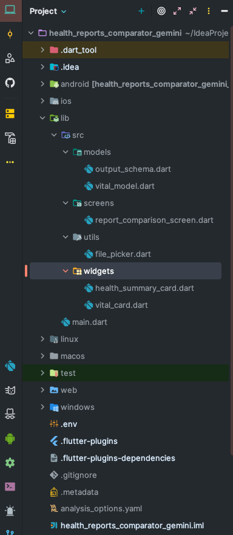

# 🩺 Health Report Comparator

**AI-Powered Medical Report Comparison Tool**

---

## 🚀 Overview

The **Health Report Comparator** is an intelligent application that enables users to securely upload two medical/health reports and receive a side-by-side analysis highlighting what has **changed**, **improved**, or **worsened**. Whether you're monitoring chronic conditions or reviewing regular checkups, this tool makes report comparison fast, easy, and meaningful.

## 📌 Features

- 🗂 **Dual Report Upload:** Upload two health reports in PDF formats.
- 🧠 **AI-Powered Extraction:** Use OCR and NLP to parse medical text, tables, and observations.
- ⚖️ **Health Metric Comparison:** Detect and classify changes across a wide range of metrics:
    - Blood pressure, cholesterol, blood sugar, BMI, diagnoses, etc.
- 🎯 **Change Classification:**
    - ✅ **Improvements**
    - ⚠️ **Deteriorations**
    - 🆕 **New Observations**
    - ❌ **Omitted Metrics**
- 📊 **Visualization & Summary:**
    - Color-coded result comparison
    - Plain-English summary of changes
---

## 👤 Target Users

- Individuals tracking personal or family health over time
- Healthcare professionals comparing patient history
- Insurers or clinics needing objective report changes

---

## 🧰 Tech Stack

| Layer    | Technology                   |
|----------|------------------------------|
| Frontend | Flutter (Android, iOS)       |
| AI       | Gemini                       |
---

## 📁 Project Structure

## 📽️ Preview

  

---